# Design Document: MacroFlow — Macro Tracker

## Overview

MacroFlow is an offline-first mobile application built with React Native + Expo (TypeScript strict mode) targeting iOS and Android. A Spring Boot 3.x / Java 21 backend handles authentication token exchange, cloud sync, and conflict resolution. PostgreSQL (Neon/Supabase) is the server-side store; expo-sqlite is the authoritative on-device store.

The guiding design principle is **low friction**: every write operation hits local SQLite first, the UI updates immediately, and a background sync queue reconciles with the server. The user never waits on the network.

All UI is styled with **NativeWind** (Tailwind-style `className` utilities for React Native). Server state for API calls is managed by **React Query** (`@tanstack/react-query`). Local/offline state is managed by **Zustand**. Auth tokens are stored in **expo-secure-store**.

### High-Level System Diagram

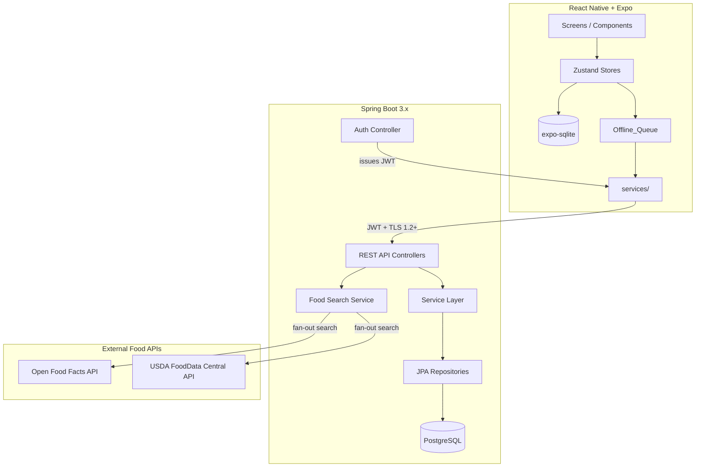

---

## Architecture

### Mobile Architecture

The mobile app follows a layered architecture:

1. **Screens** — thin orchestrators; read from Zustand stores, dispatch actions, render UI.
2. **Zustand Stores** — one per domain (`mealStore`, `userStore`, `reminderStore`, `analyticsStore`). Derived values (remaining macros, adherence %) computed inside stores or selector hooks.
3. **`db/` layer** — all expo-sqlite access. Exposes typed async helpers; no raw SQL outside this layer.
4. **`sync/` layer** — manages the Offline_Queue. Drains in insertion order on reconnect. Uses client-generated UUIDs as idempotency keys.
5. **`services/` layer** — typed HTTP clients for the backend API. Called only by the sync layer or auth flow; never directly from components.
6. **`utils/`** — pure functions: TDEE calculation, calorie formula, macro split, portion scaling, analytics aggregation.

### Backend Architecture

Spring Boot follows a strict three-tier layout:

1. **Controllers** — request validation (`@Valid`) and delegation only.
2. **Services** — all business logic; assume authenticated principal from JWT filter.
3. **Repositories** — Spring Data JPA; all schema changes via Flyway migrations.

Stateless JWT auth: the mobile app exchanges an Apple/Google provider token at `/auth/token`; the backend verifies it with the provider, creates or looks up the user, and returns a signed JWT. All subsequent requests carry this JWT in the `Authorization: Bearer` header.

### JWT Authentication Strategy

The backend issues short-lived access tokens and longer-lived refresh tokens. The mobile app handles silent refresh transparently so the user is never interrupted mid-session.

**Token lifecycle:**

| Token | Lifetime | Storage |
|---|---|---|
| Access token (JWT) | 15 minutes | In-memory only (Zustand `userStore`) |
| Refresh token (opaque) | 30 days | `expo-secure-store` (encrypted on-device) |

**Flow:**

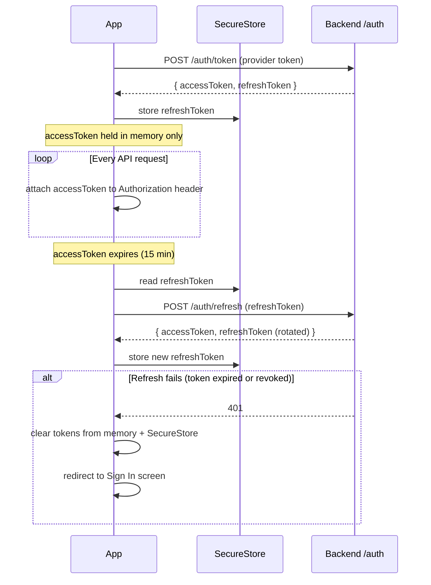

**Key rules:**
- Access tokens are never written to persistent storage — only held in memory to limit exposure if the device is compromised
- Refresh tokens are rotated on every use (refresh token rotation); the old token is invalidated server-side
- The `/auth/refresh` endpoint is the only endpoint that accepts a refresh token; all other endpoints require a valid access token
- `services/authService.ts` manages token exchange, silent refresh, and SecureStore read/write; no other layer touches tokens directly
- On sign-out, both the in-memory access token and the SecureStore refresh token are cleared; the refresh token is also revoked server-side via `DELETE /auth/session`

**Backend endpoints added:**

| Method | Path | Description |
|---|---|---|
| `POST` | `/auth/refresh` | Exchange a valid refresh token for a new access token + rotated refresh token |
| `DELETE` | `/auth/session` | Revoke the current refresh token (called on sign-out) |

---

### Food Search Strategy

Food search is handled entirely by the backend. The mobile app calls `GET /api/v1/foods?q=` and receives a unified, normalised list — it has no direct knowledge of the external APIs.

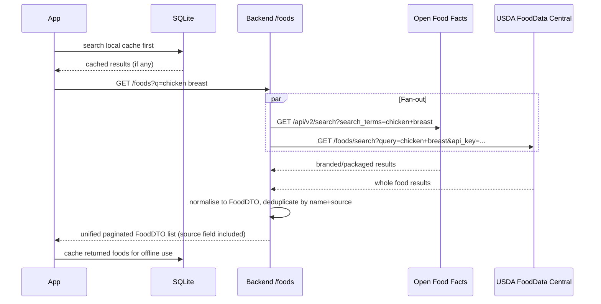

**Normalisation rules:**
- Both sources are mapped to the same `FoodDTO` shape: `id`, `name`, `calories`, `proteinG`, `carbsG`, `fatG`, `servingG`, `source`
- `source` is one of `OFF` | `USDA` | `CUSTOM` — shown as a small label in search results
- Deduplication: if the same food name appears in both sources, the USDA result takes precedence (more authoritative for whole foods); OFF result is kept for branded/packaged items
- The USDA API key is stored as an environment variable (`USDA_API_KEY`) — never hardcoded

**Caching:**
- Foods returned from search are written to the local SQLite `food` table on selection or log
- Subsequent searches check SQLite first; network results supplement the local cache
- This ensures previously searched foods are available fully offline

**Attribution:**
- Open Food Facts requires ODbL attribution; a visible "Data from Open Food Facts" notice is shown in the food search screen footer and in the app's About section in Settings

**`food` table additions (SQLite and PostgreSQL):**
- `source TEXT NOT NULL DEFAULT 'CUSTOM'` — tracks origin (`OFF`, `USDA`, `CUSTOM`)
- `external_id TEXT` — stores the original ID from the source API for deduplication

---

### Sync Strategy

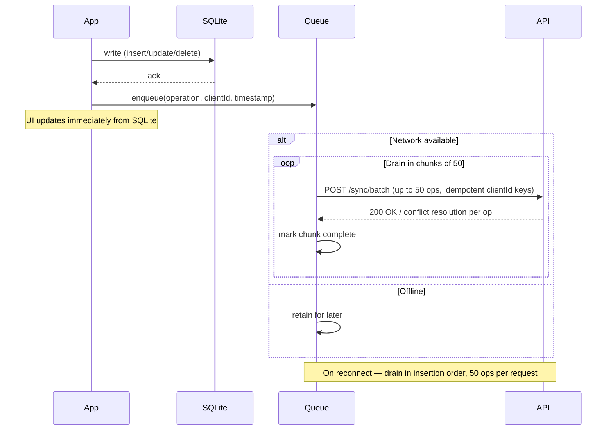

**Conflict resolution:** the server applies the operation with the latest `client_timestamp`. The resolved state is returned in the sync response and written back to SQLite.

**Batch chunking:** the queue is drained in chunks of 50 operations per `POST /sync/batch` request. This prevents payload size limits and request timeouts when a large backlog has accumulated (e.g. after several days offline). Each chunk is fully processed and marked complete before the next chunk is sent. If the network drops mid-drain, the next reconnect resumes from the first incomplete chunk — already-sent chunks are not re-sent because their operations are marked `sent` in the queue.

---

## Frontend Architecture

### NativeWind Setup

NativeWind is configured at project root. The Babel plugin transforms `className` props at build time; Metro is configured to process the Tailwind CSS output.

**Required files:**
- `tailwind.config.js` — token set (colors, spacing, font sizes, border radius)
- `babel.config.js` — includes `nativewind/babel` plugin
- `metro.config.js` — wraps default config with `withNativeWind`
- `global.css` — must be the first import in `App.tsx` (`import './global.css'`); without this, `className` props have no effect at runtime

**Dark mode:** `darkMode: "class"` in `tailwind.config.js` — the app supports both system-following and manual theme selection. The `ThemeProvider` in `App.tsx` reads the user's saved theme preference (`light` | `dark` | `system`) and applies the `dark` class to the root view accordingly. When set to `system`, it follows the device theme via `useColorScheme()`. (Requirement 12.4)

### Design Token Set

```js
// tailwind.config.js
// darkMode: "class" — controlled programmatically by ThemeProvider, not by media query
colors: {
  background: { DEFAULT: '#FFFFFF', dark: '#0B0B0C' },
  surface:    { DEFAULT: '#F7F7F8', dark: '#141416' },
  text:       { DEFAULT: '#111827', dark: '#F3F4F6' },
  muted:      { DEFAULT: '#6B7280', dark: '#9CA3AF' },
  primary:    { DEFAULT: '#0EA5E9', dark: '#38BDF8' },
  warning:    { DEFAULT: '#F59E0B', dark: '#FBBF24' },  // over-target states on SummaryCard / MacroProgressBar
},
borderRadius: { md: '12px' },
// Spacing scale: 2, 4, 6, 8, 12, 16, 20, 24
// Font sizes: xs, sm, base, lg, xl, 2xl
```

All class strings use these tokens — no hardcoded hex values in `className` props.

**Color token usage notes:**
- `warning` / `dark:warning-dark` — used exclusively for over-target states on `SummaryCard` and `MacroProgressBar` (Requirements 8.6, 8.7). Never use amber hex values directly in `className`.
- `muted` is a flat color token and does not support opacity modifiers. Use `border-black/5 dark:border-white/5` for subtle borders instead of `border-muted/10`.

**`Chip` selected vs unselected class strings:**
- Unselected: `bg-background dark:bg-background-dark border border-black/5 dark:border-white/10`
- Selected: `bg-primary dark:bg-primary-dark border border-primary dark:border-primary-dark`
- Text unselected: `text-text dark:text-text-dark`
- Text selected: `text-white`

### React Query Integration

React Query manages all server-side state (food search, analytics, sync status). Zustand manages local/offline state (daily log, targets, reminder config). The two layers are kept separate — React Query never writes to SQLite directly; mutations go through the `db/` layer first, then the Offline_Queue.

```
React Query (server state)
  └── useQuery / useMutation → services/ → backend API
      └── on success: invalidate query cache

Zustand (local state)
  └── store actions → db/ helpers → SQLite
      └── also enqueues to Offline_Queue for sync
```

**Query key conventions:**
- `['foods', query]` — food search results
- `['analytics', 'weekly']` / `['analytics', 'monthly']` — analytics data
- `['user', 'me']` — profile and targets from server

**QueryClient config:**
- `staleTime: 5 * 60 * 1000` (5 min) for food search and analytics
- `retry: 1` — single retry on failure; offline writes don't use React Query

### `src/ui/` Component Library

Reusable NativeWind-styled primitives. Each component accepts a `className` prop for caller overrides. No `StyleSheet.create` or inline styles anywhere.

| Component | Props | Notes |
|---|---|---|
| `Button` | `title`, `onPress`, `variant`, `disabled`, `className` | `variant`: `primary` \| `ghost` |
| `Card` | `children`, `className` | Surface bg, rounded-md, subtle border |
| `TextField` | `label`, `value`, `onChangeText`, `error`, `className` | Inline validation error below input |
| `ListItem` | `label`, `value?`, `onPress?`, `showChevron?`, `className` | Standard settings/list row |
| `Chip` | `label`, `selected`, `onPress`, `className` | Pill shape; unselected: `bg-background dark:bg-background-dark border border-black/5 dark:border-white/10`; selected: `bg-primary dark:bg-primary-dark border border-primary dark:border-primary-dark` |
| `Badge` | `value`, `className` | Small numeric indicator |
| `Divider` | `className` | `border-b border-black/5 dark:border-white/5` |
| `EmptyState` | `heading`, `subtext`, `ctaLabel?`, `onCta?`, `className` | Centered empty list state |
| `Snackbar` | `message`, `action?`, `visible`, `onDismiss` | Bottom toast; used for undo confirmation |

### Screen → Component Mapping

Each screen is a thin orchestrator that composes `src/ui/` primitives and domain-specific components from `src/components/`.

| Screen | Key `src/ui/` primitives used | Key domain components |
|---|---|---|
| `OnboardingScreen` | `TextField`, `Button`, `Chip` (activity level) | `MacroTargetPreview` |
| `GoalScreen` | `Button` (3 goal options) | — |
| `HomeScreen` | `Card`, `Button` (Quick Add FAB) | `SummaryCard`, `MealEntryList` |
| `AddMealScreen` | `TextField` (search), `ListItem`, `EmptyState` | `RecentlyLoggedList`, `PortionPicker` |
| `FoodDetailScreen` | `Chip` (0.5×/1×/1.5×/2×), `TextField`, `Button` | `MacroPreview`, `PortionPicker` |
| `AnalyticsScreen` | `Card`, `Chip` (week/month toggle) | `ChartWrapper`, `AdherenceRow` |
| `SettingsScreen` | `ListItem`, `Divider`, `Button` | `ReminderToggleRow`, `ThemeSelector` |

### Accessibility Conventions

- All `Pressable` elements carry `accessibilityRole` and `accessibilityLabel`
- Touch targets are minimum 44×44 pt — enforced via `min-h-[44px] min-w-[44px]` on the wrapper when the visual element is smaller
- `TextInput` fields carry `accessibilityLabel` matching their visible label
- `FlatList` items are memoized; `keyExtractor` always provided

---

## Components and Interfaces

### Mobile Components

#### Screens
| Screen | Responsibility |
|---|---|
| `HomeScreen` | Renders `SummaryCard`, today's `MealEntryList`, quick-add FAB |
| `AddMealScreen` | Manual entry fields (primary), `RecentlyLoggedList`, food database search field (supplementary); date selector allows logging to any date within the rolling 7-day window |
| `FoodDetailScreen` | Portion quick-select (0.5x/1x/1.5x/2x), gram input, macro preview |
| `AnalyticsScreen` | Weekly bar chart, monthly line chart, day-drill-down |
| `OnboardingScreen` | Multi-step form: profile -> goal -> targets review |
| `TutorialScreen` | Up to 4 skippable walkthrough cards |
| `SettingsScreen` | Reminder config, account management, target overrides, recently-logged max, replay tutorial |
| `ProfileScreen` | Edit all onboarding fields (sex, date of birth, height, weight, activity, goal, timezone); triggers immediate target recalculation on save; accessible from Settings |

#### Key Shared Components
- `SummaryCard` — remaining calories + 3 macro progress bars; updates reactively from `mealStore`. When any value goes below zero, switches to an over-target visual state showing the excess amount with a warning colour treatment. Styled with NativeWind; uses `Card` primitive from `src/ui/`.
- `MacroProgressBar` — single macro with label, consumed/target, over-target indicator shown when remaining is zero or below. Props: `label: string`, `consumed: number`, `target: number`, `className?: string`. When `consumed >= target` (i.e. remaining ≤ 0), renders in `warning` color to indicate over-target state.
- `PortionPicker` — `Chip` quick-select buttons (0.5×/1×/1.5×/2×) + `TextField` numeric input with unit toggle (servings vs grams).
- `MealEntryRow` — swipe-to-delete/edit, contextual menu, undo `Snackbar`.
- `ChartWrapper` — thin wrapper around Victory Native / react-native-chart-kit enforcing max 3 series.
- `ThemeSelector` — three-option selector (`Light` / `Dark` / `System`) rendered as a `Chip` row in Settings. On selection, writes the preference to `userStore` and SQLite immediately; the `ThemeProvider` in `App.tsx` reacts to the store change and applies or removes the `dark` class on the root view.

#### Zustand Stores

```typescript
// mealStore — source of truth for today's log
interface MealStore {
  entries: MealEntry[];
  addEntry: (entry: Omit<MealEntry, 'id'>) => Promise<void>;
  editEntry: (id: string, patch: Partial<MealEntry>) => Promise<void>;
  deleteEntry: (id: string) => Promise<void>;
  duplicateEntry: (id: string) => Promise<void>;
  loadDay: (date: string) => Promise<void>;
  // derived
  totals: MacroTotals;
  remaining: MacroTotals; // targets minus totals
}

// userStore — profile + targets
interface UserStore {
  profile: UserProfile | null;
  targets: DailyTargets;
  theme: 'light' | 'dark' | 'system'; // persisted preference; ThemeProvider reads this
  setProfile: (p: UserProfile) => void;
  overrideTargets: (t: Partial<DailyTargets>) => void;
  recalculateTargets: () => void;
  setTheme: (theme: 'light' | 'dark' | 'system') => Promise<void>; // writes to SQLite + enqueues sync
}

// reminderStore — reminder configuration and scheduling state
interface ReminderStore {
  config: ReminderConfig;
  setConfig: (patch: Partial<ReminderConfig>) => Promise<void>;
  // re-schedules all enabled reminders via Expo Notifications.
  // Daily reminders (meal, eod, streak) use a repeating daily trigger at the configured HH:mm.
  // The weekly check-in uses a weekly trigger on checkin_day at checkin_time — a different
  // Expo Notifications schedule type from the daily reminders; handle separately in scheduleAll.
  scheduleAll: () => Promise<void>;
  cancelAll: () => Promise<void>;
}

// analyticsStore — aggregated stats for the analytics screen
interface AnalyticsStore {
  weeklyAverages: MacroTotals | null;
  monthlyCalories: { date: string; calories: number }[];
  adherence: { protein: number; carbs: number; fat: number; calories: number } | null;
  streakCount: number;  // consecutive days with at least one entry; required for weekly summary report (Requirement 5.1)
  loadWeekly: () => Promise<void>;
  loadMonthly: () => Promise<void>;
}
```

#### Services / API Client
- `services/apiClient.ts` — base Axios instance with JWT interceptor (attaches `Authorization: Bearer` header; handles silent refresh on 401)
- `services/authService.ts` — token exchange, silent refresh, SecureStore read/write for refresh token
- `services/syncService.ts` — POST /sync/batch
- `services/foodService.ts` — fan-out search to backend `/foods?q=`; results cached to SQLite via `db/` layer

**React Query hooks** (in `src/hooks/`):
- `useFoodSearch(query)` — wraps `foodService`; `staleTime: 5min`; disabled when query is empty or fewer than 2 characters; input is debounced 300ms before the query fires so the API is not called on every keystroke; while the network request is in-flight a loading indicator is shown inside the search field (not a full-screen spinner); local SQLite cache results are shown immediately while the API response is pending, then merged and updated when it arrives
- `useWeeklyAnalytics()` — wraps `GET /analytics/weekly`
- `useMonthlyAnalytics()` — wraps `GET /analytics/monthly`
- `useUserProfile()` — wraps `GET /users/me`; invalidated on profile save

### Backend REST API

Base path: `/api/v1`

| Method | Path | Description |
|---|---|---|
| `POST` | `/auth/token` | Exchange provider token for JWT |
| `POST` | `/auth/refresh` | Exchange a valid refresh token for a new access token + rotated refresh token |
| `DELETE` | `/auth/session` | Revoke the current refresh token (called on sign-out) |
| `DELETE` | `/auth/account` | Delete account and all associated data |
| `GET` | `/foods` | Search food database — fans out to Open Food Facts and USDA FoodData Central, merges and deduplicates results (query param `q`, paginated) |
| `POST` | `/foods/custom` | Create custom food |
| `PUT` | `/foods/custom/{id}` | Update custom food |
| `DELETE` | `/foods/custom/{id}` | Delete custom food; does not alter previously logged meal entries |
| `GET` | `/meal-entries` | List entries for a date range |
| `POST` | `/sync/batch` | Idempotent batch upsert of queued operations |
| `GET` | `/saved-meals` | List all saved meals for the authenticated user |
| `POST` | `/saved-meals` | Create a new saved meal (user-private unless items reference external foods) |
| `PUT` | `/saved-meals/{id}` | Update saved meal name or items; ownership enforced |
| `DELETE` | `/saved-meals/{id}` | Delete a saved meal; does not affect previously logged entries |
| `GET` | `/analytics/weekly` | Aggregated weekly stats |
| `GET` | `/analytics/monthly` | Daily calorie series for 30 days |
| `GET` | `/users/me` | Profile and targets |
| `PUT` | `/users/me` | Update profile and targets |
| `GET` | `/users/me/preferences` | Get user preferences (recently-logged max, tutorial_shown) |
| `PUT` | `/users/me/preferences` | Update user preferences |

All list endpoints are paginated. All responses use DTOs; JPA entities are never exposed.

---

## Data Models

### Mobile (expo-sqlite)

```sql
-- Single-row user profile
CREATE TABLE user_profile (
    id          TEXT PRIMARY KEY,
    sex         TEXT NOT NULL,
    date_of_birth  TEXT NOT NULL,  -- ISO-8601 date (YYYY-MM-DD); age derived at calculation time
    height_cm   REAL NOT NULL,
    weight_kg   REAL NOT NULL,
    activity    TEXT NOT NULL,  -- sedentary|light|moderate|active|very_active
    goal        TEXT NOT NULL,  -- lose|maintain|gain
    timezone    TEXT NOT NULL DEFAULT 'UTC',  -- IANA timezone identifier; governs streak resets, reminder scheduling, and daily log boundaries
    updated_at  TEXT NOT NULL
);

-- Single-row daily targets; is_override=1 means user manually set values
CREATE TABLE daily_targets (
    id              TEXT PRIMARY KEY DEFAULT 'singleton',
    calories_kcal   REAL NOT NULL,
    protein_g       REAL NOT NULL,
    carbs_g         REAL NOT NULL,
    fat_g           REAL NOT NULL,
    is_override     INTEGER NOT NULL DEFAULT 0
);

-- Food database (seeded global foods + user custom foods).
-- Cleanup policy: on app launch, rows where source != 'CUSTOM' and the food_id
-- does not appear in meal_entry or recently_logged and synced_at is older than
-- 90 days are hard-deleted to prevent unbounded cache growth from search results.
CREATE TABLE food (
    id          TEXT PRIMARY KEY,
    name        TEXT NOT NULL,
    calories    REAL NOT NULL,
    protein_g   REAL NOT NULL,
    carbs_g     REAL NOT NULL,
    fat_g       REAL NOT NULL,
    serving_g   REAL NOT NULL,
    is_custom   INTEGER NOT NULL DEFAULT 0,
    source      TEXT NOT NULL DEFAULT 'CUSTOM',  -- CUSTOM | OFF | USDA
    external_id TEXT,                             -- original ID from source API; used for deduplication
    synced_at   TEXT
);

CREATE TABLE saved_meal (
    id      TEXT PRIMARY KEY,
    name    TEXT NOT NULL
);

CREATE TABLE saved_meal_item (
    id             TEXT PRIMARY KEY,
    saved_meal_id  TEXT NOT NULL REFERENCES saved_meal(id) ON DELETE CASCADE,
    food_id        TEXT NOT NULL REFERENCES food(id),
    servings       REAL NOT NULL DEFAULT 1.0
);

-- Meal entries are snapshotted at log time so edits to a food do not alter history.
-- Edit/delete window: entries within the rolling 7-day window (in the user's timezone)
-- are editable; entries older than 7 days are read-only. New entries may also be added
-- to any date within the 7-day window.
-- Cleanup policy: on app launch, rows with deleted=1 and log_date older than 92 days
-- are hard-deleted (matches the 3-month analytics display window; data is already
-- synced to the server before this point).
CREATE TABLE meal_entry (
    id           TEXT PRIMARY KEY,   -- client-generated UUID
    food_id      TEXT NOT NULL REFERENCES food(id),
    log_date     TEXT NOT NULL,      -- YYYY-MM-DD
    logged_at    TEXT NOT NULL,      -- ISO-8601 datetime
    meal_name    TEXT,
    servings     REAL NOT NULL DEFAULT 1.0,
    protein_g    REAL NOT NULL,      -- snapshot at log time
    carbs_g      REAL NOT NULL,
    fat_g        REAL NOT NULL,
    calories     REAL NOT NULL,
    deleted      INTEGER NOT NULL DEFAULT 0,
    synced_at    TEXT
);

-- Pending operations waiting to be uploaded; drained in insertion order.
-- Cleanup policy: after each drain, rows with status='sent' older than 7 days
-- are hard-deleted; rows with status='failed' older than 30 days are hard-deleted.
CREATE TABLE offline_queue (
    id            INTEGER PRIMARY KEY AUTOINCREMENT,
    client_id     TEXT NOT NULL UNIQUE,  -- idempotency key
    operation     TEXT NOT NULL,         -- INSERT|UPDATE|DELETE
    entity_type   TEXT NOT NULL,
    payload       TEXT NOT NULL,         -- JSON blob
    created_at    TEXT NOT NULL,
    status        TEXT NOT NULL DEFAULT 'pending'  -- pending|sent|failed
);

-- Materialised recently-logged list; scoped per user so sign-in switches
-- show the correct list and the server can restore it on new device installs.
-- After every upsert, rows beyond recentlyLoggedMax for that user are pruned
-- immediately so the table stays bounded to at most 20 rows per user.
CREATE TABLE recently_logged (
    user_id      TEXT NOT NULL,                    -- scopes list to the signed-in user
    food_id      TEXT NOT NULL REFERENCES food(id),
    last_logged  TEXT NOT NULL,
    PRIMARY KEY (user_id, food_id)
);

-- Reminder configuration; stored locally so Expo Notifications can schedule reminders fully offline
CREATE TABLE reminder_config (
    id              TEXT PRIMARY KEY DEFAULT 'singleton',
    meal_enabled    INTEGER NOT NULL DEFAULT 1,
    meal_time       TEXT NOT NULL DEFAULT '12:00',    -- HH:mm
    eod_enabled     INTEGER NOT NULL DEFAULT 1,
    eod_time        TEXT NOT NULL DEFAULT '20:00',    -- HH:mm
    streak_enabled  INTEGER NOT NULL DEFAULT 0,
    streak_time     TEXT NOT NULL DEFAULT '21:00',    -- HH:mm
    checkin_enabled INTEGER NOT NULL DEFAULT 0,
    checkin_day     INTEGER NOT NULL DEFAULT 0         -- 0=Sunday; weekly check-in uses a different scheduling path than daily reminders
);

-- User preferences: recently-logged cap, tutorial state, and theme selection
CREATE TABLE user_preferences (
    id                   TEXT PRIMARY KEY DEFAULT 'singleton',
    recently_logged_max  INTEGER NOT NULL DEFAULT 10,  -- user-configurable 5–20
    tutorial_shown       INTEGER NOT NULL DEFAULT 0,   -- 1 once completed or skipped; synced to server
    theme                TEXT NOT NULL DEFAULT 'system' -- light|dark|system; system follows device setting
);
```

### Backend (PostgreSQL — Flyway managed)

```sql
-- V1__init.sql

CREATE TABLE app_user (
    id           UUID PRIMARY KEY DEFAULT gen_random_uuid(),
    provider     TEXT NOT NULL,   -- apple|google
    provider_sub TEXT NOT NULL,
    created_at   TIMESTAMPTZ NOT NULL DEFAULT now(),
    UNIQUE (provider, provider_sub)
);

CREATE TABLE user_profile (
    user_id      UUID PRIMARY KEY REFERENCES app_user(id) ON DELETE CASCADE,
    sex          TEXT NOT NULL,
    date_of_birth  DATE NOT NULL,  -- age derived at calculation time; never store a stale integer
    height_cm    NUMERIC(5,2) NOT NULL,
    weight_kg    NUMERIC(5,2) NOT NULL,
    activity     TEXT NOT NULL,
    goal         TEXT NOT NULL,
    timezone     TEXT NOT NULL DEFAULT 'UTC',  -- IANA timezone identifier; governs streak resets, reminder scheduling, and daily log boundaries
    updated_at   TIMESTAMPTZ NOT NULL DEFAULT now()
);

CREATE TABLE daily_targets (
    user_id        UUID PRIMARY KEY REFERENCES app_user(id) ON DELETE CASCADE,
    calories_kcal  NUMERIC(7,2) NOT NULL,
    protein_g      NUMERIC(6,2) NOT NULL,
    carbs_g        NUMERIC(6,2) NOT NULL,
    fat_g          NUMERIC(6,2) NOT NULL,
    is_override    BOOLEAN NOT NULL DEFAULT false,
    updated_at     TIMESTAMPTZ NOT NULL DEFAULT now()
);

-- owner_id NULL = global food in the shared database
CREATE TABLE food (
    id          UUID PRIMARY KEY DEFAULT gen_random_uuid(),
    owner_id    UUID REFERENCES app_user(id) ON DELETE CASCADE,
    name        TEXT NOT NULL,
    calories    NUMERIC(7,2) NOT NULL,
    protein_g   NUMERIC(6,2) NOT NULL,
    carbs_g     NUMERIC(6,2) NOT NULL,
    fat_g       NUMERIC(6,2) NOT NULL,
    serving_g   NUMERIC(6,2) NOT NULL,
    is_custom   BOOLEAN NOT NULL DEFAULT false,
    source      TEXT NOT NULL DEFAULT 'CUSTOM',  -- CUSTOM | OFF | USDA
    external_id TEXT,                             -- original ID from source API; used for deduplication
    created_at  TIMESTAMPTZ NOT NULL DEFAULT now()
);

-- Macro values are snapshotted at log time; client_ts used for conflict resolution.
-- The service layer enforces the 7-day edit window using the user's stored timezone;
-- attempts to insert or mutate entries outside this window return 422.
CREATE TABLE meal_entry (
    id           UUID PRIMARY KEY,
    user_id      UUID NOT NULL REFERENCES app_user(id) ON DELETE CASCADE,
    food_id      UUID NOT NULL REFERENCES food(id),
    log_date     DATE NOT NULL,
    logged_at    TIMESTAMPTZ NOT NULL,
    meal_name    TEXT,
    servings     NUMERIC(6,3) NOT NULL,
    protein_g    NUMERIC(6,2) NOT NULL,
    carbs_g      NUMERIC(6,2) NOT NULL,
    fat_g        NUMERIC(6,2) NOT NULL,
    calories     NUMERIC(7,2) NOT NULL,
    deleted      BOOLEAN NOT NULL DEFAULT false,
    client_ts    TIMESTAMPTZ NOT NULL,
    updated_at   TIMESTAMPTZ NOT NULL DEFAULT now()
);

CREATE INDEX idx_meal_entry_user_date ON meal_entry(user_id, log_date);

CREATE TABLE saved_meal (
    id       UUID PRIMARY KEY DEFAULT gen_random_uuid(),
    user_id  UUID NOT NULL REFERENCES app_user(id) ON DELETE CASCADE,
    name     TEXT NOT NULL
);

CREATE TABLE saved_meal_item (
    id            UUID PRIMARY KEY DEFAULT gen_random_uuid(),
    saved_meal_id UUID NOT NULL REFERENCES saved_meal(id) ON DELETE CASCADE,
    food_id       UUID NOT NULL REFERENCES food(id),
    servings      NUMERIC(6,3) NOT NULL DEFAULT 1.0
);

-- Materialised recently-logged list; scoped per user; synced so it restores on new devices
CREATE TABLE recently_logged (
    user_id      UUID NOT NULL REFERENCES app_user(id) ON DELETE CASCADE,
    food_id      UUID NOT NULL REFERENCES food(id),
    last_logged  TIMESTAMPTZ NOT NULL,
    PRIMARY KEY (user_id, food_id)
);

CREATE TABLE reminder_config (
    user_id         UUID PRIMARY KEY REFERENCES app_user(id) ON DELETE CASCADE,
    meal_enabled    BOOLEAN NOT NULL DEFAULT true,
    meal_time       TIME NOT NULL DEFAULT '12:00',
    eod_enabled     BOOLEAN NOT NULL DEFAULT true,
    eod_time        TIME NOT NULL DEFAULT '20:00',
    streak_enabled  BOOLEAN NOT NULL DEFAULT false,
    streak_time     TIME NOT NULL DEFAULT '21:00',
    checkin_enabled BOOLEAN NOT NULL DEFAULT false,
    checkin_day     INT NOT NULL DEFAULT 0  -- 0=Sunday
);

-- User preferences: recently-logged cap, tutorial state, and theme selection
CREATE TABLE user_preferences (
    user_id              UUID PRIMARY KEY REFERENCES app_user(id) ON DELETE CASCADE,
    recently_logged_max  INT NOT NULL DEFAULT 10,      -- user-configurable 5–20
    tutorial_shown       BOOLEAN NOT NULL DEFAULT false, -- suppresses tutorial on all devices once true
    theme                TEXT NOT NULL DEFAULT 'system'  -- light|dark|system; synced across devices
);
```

### TypeScript Domain Types

```typescript
// src/types/index.ts

export interface MacroTotals {
  calories: number;
  protein: number;
  carbs: number;
  fat: number;
}

export interface DailyTargets extends MacroTotals {
  isOverride: boolean;
}

export interface UserProfile {
  id: string;
  sex: 'male' | 'female';
  dateOfBirth: string; // ISO-8601 date string (YYYY-MM-DD); age calculated from this at TDEE time
  heightCm: number;
  weightKg: number;
  activity: 'sedentary' | 'light' | 'moderate' | 'active' | 'very_active';
  goal: 'lose' | 'maintain' | 'gain';
  timezone: string; // IANA timezone identifier e.g. 'America/New_York'
}

export interface Food {
  id: string;
  name: string;
  calories: number;
  proteinG: number;
  carbsG: number;
  fatG: number;
  servingG: number;
  isCustom: boolean;
  source: 'CUSTOM' | 'OFF' | 'USDA';
  externalId: string | null; // original ID from source API; null for custom foods
}

export interface MealEntry {
  id: string;        // client-generated UUID
  foodId: string;
  logDate: string;   // YYYY-MM-DD
  loggedAt: string;  // ISO datetime
  mealName?: string;
  servings: number;
  proteinG: number;
  carbsG: number;
  fatG: number;
  calories: number;
}

export interface OfflineOperation {
  clientId: string;
  operation: 'INSERT' | 'UPDATE' | 'DELETE';
  entityType: string;
  payload: unknown;
  createdAt: string;
}

export interface ReminderConfig {
  mealEnabled: boolean;
  mealTime: string;       // HH:mm
  eodEnabled: boolean;
  eodTime: string;        // HH:mm
  streakEnabled: boolean;
  streakTime: string;     // HH:mm
  checkinEnabled: boolean;
  checkinDay: number;     // 0=Sunday
}

export interface UserPreferences {
  recentlyLoggedMax: number; // 5–20, default 10
  tutorialShown: boolean;    // persisted to server; suppresses tutorial across all devices
  theme: 'light' | 'dark' | 'system'; // user-selected theme; 'system' follows device setting
}
```

---

## Correctness Properties

*A property is a characteristic or behavior that should hold true across all valid executions of a system — essentially, a formal statement about what the system should do. Properties serve as the bridge between human-readable specifications and machine-verifiable correctness guarantees.*

### Property 1: Calorie formula correctness

*For any* non-negative protein, carbohydrate, and fat gram values, the computed calorie total must equal `(protein × 4) + (carbohydrate × 4) + (fat × 9)`.

**Validates: Requirements 1.4**

---

### Property 2: Food macro pre-population

*For any* food in the database selected at the default serving size (1 serving), the pre-populated macro values shown to the user must equal the food's stored protein, carbs, fat, and calorie values exactly.

**Validates: Requirements 1.4**

---

### Property 3: Meal entry round-trip

*For any* valid meal entry submitted to the daily log, querying the daily log for that date must return an entry with the same food ID, servings, and macro snapshot values.

**Validates: Requirements 1.5**

---

### Property 4: Custom food round-trip

*For any* custom food created with a given name, serving size, and macro values, retrieving that food must return the same name, serving size, and macro values.

**Validates: Requirements 1.8**

---

### Property 5: Custom food edit does not alter history

*For any* custom food that has been logged in prior meal entries, editing the food's macro values must leave all existing meal entry macro snapshots unchanged while future lookups of the food reflect the new values.

**Validates: Requirements 1.9**

---

### Property 6: Saved meal round-trip

*For any* saved meal created with a collection of foods and portions, retrieving the saved meal must return the same set of food IDs and portion values.

**Validates: Requirements 1.10**

---

### Property 7: Saved meal logging expands to N entries

*For any* saved meal containing N foods, logging that saved meal must add exactly N meal entries to the daily log — one per food.

**Validates: Requirements 1.13**

---

### Property 8: TDEE and target calculation correctness

*For any* valid user profile (sex, age, height, weight, activity level, goal), the calculated calorie target must equal the Mifflin-St Jeor TDEE adjusted by −500 for loss, 0 for maintenance, or +300 for gain — and this must hold both at initial onboarding and after any subsequent profile update.

**Validates: Requirements 2.4, 2.7**

---

### Property 9: Default macro split correctness

*For any* calculated calorie target, the default macro targets must satisfy: `protein_g = (0.30 × calories) / 4`, `carbs_g = (0.40 × calories) / 4`, `fat_g = (0.30 × calories) / 9` (within floating-point tolerance).

**Validates: Requirements 2.5**

---

### Property 10: Target override round-trip

*For any* manually set override values for calories and each macro, reading back the daily targets must return those exact override values and the `isOverride` flag must be true.

**Validates: Requirements 2.8**

---

### Property 11: Reminder daily cap invariant

*For any* day and any combination of reminder trigger conditions (meal, end-of-day, streak), the total number of push notifications dispatched must not exceed 3.

**Validates: Requirements 3.6**

---

### Property 12: Reminder configuration round-trip

*For any* reminder configuration (enabled/disabled state and time for each reminder type), reading back the saved configuration must return the same enabled states and times for all reminder types.

**Validates: Requirements 3.4, 3.5**

---

### Property 13: Weekly average calculation correctness

*For any* set of daily logs over a 7-day period, the computed weekly average for each macro and calories must equal the sum of daily totals divided by the number of days with at least one entry.

**Validates: Requirements 4.1**

---

### Property 14: Daily calorie aggregation correctness

*For any* set of meal entries on a given day, the daily calorie total must equal the sum of the `calories` field across all non-deleted entries for that date.

**Validates: Requirements 4.2**

---

### Property 15: Adherence percentage correctness

*For any* actual intake value and non-zero target value, the adherence percentage must equal `(actual / target) × 100`.

**Validates: Requirements 4.3**

---

### Property 16: Day drill-down round-trip

*For any* day that has logged entries, selecting that day in the analytics view must return the same set of meal entries as querying the daily log directly for that date.

**Validates: Requirements 4.4**

---

### Property 17: Weekly summary report content

*For any* set of weekly logs, the generated weekly summary report must contain the correct average daily macro intake, calorie adherence percentage, and streak count for the 7-day period.

**Validates: Requirements 5.1**

---

### Property 18: Recently logged list ordering and deduplication

*For any* log history and configured maximum N (5–20), the recently logged list must contain at most N unique food IDs, ordered by most recent log time descending, with no food appearing more than once.

**Validates: Requirements 6.2, 6.5**

---

### Property 19: Recently logged list updates on log

*For any* food that is logged, it must appear at the top (position 0) of the recently logged list immediately after the log action.

**Validates: Requirements 6.4**

---

### Property 20: Portion multiplier scaling correctness

*For any* food and any portion multiplier M, the resulting macro and calorie values must equal the food's per-serving values multiplied by M (within floating-point tolerance).

**Validates: Requirements 7.2**

---

### Property 21: Serving/gram unit conversion round-trip

*For any* food with a known `serving_g` value, converting a serving count to grams and back to servings must yield the original serving count (within floating-point tolerance).

**Validates: Requirements 7.4**

---

### Property 22: Summary card remaining values correctness

*For any* set of meal entries and daily targets, the remaining values displayed on the summary card must equal `target − sum(entries)` for each of calories, protein, carbs, and fat.

**Validates: Requirements 8.1**

---

### Property 23: Target-met and over-target indicator correctness

*For any* macro or calorie where the remaining value is zero or below, the summary card must display the "target met or exceeded" visual indicator for that nutrient; for any remaining value above zero, the indicator must not be shown. Furthermore, when the remaining value is strictly below zero, the summary card must display the excess amount (the absolute value of the negative remaining) alongside a distinct warning visual treatment.

**Validates: Requirements 8.4, 8.5, 8.6, 8.7**

---

### Property 24: Offline write goes to queue

*For any* write operation (insert, update, delete) performed while the network is unavailable, the operation must be present in the Offline_Queue with status `pending` after the operation completes.

**Validates: Requirements 9.2**

---

### Property 25: Queue drain on reconnect

*For any* set of pending operations in the Offline_Queue, after network connectivity is restored, all operations must be uploaded to the sync service in insertion order and marked as complete.

**Validates: Requirements 9.3**

---

### Property 26: Conflict resolution by latest timestamp

*For any* two conflicting operations on the same entity, the sync service must apply the operation with the later `client_ts` and the resulting server state must reflect that operation's payload.

**Validates: Requirements 9.5**

---

### Property 27: Delete removes entry from log

*For any* meal entry present in the daily log, deleting it must result in that entry no longer appearing in the daily log query for that date.

**Validates: Requirements 10.2**

---

### Property 28: Duplicate entry preserves food and portion

*For any* meal entry, duplicating it must create a new entry with the same `food_id` and `servings` values, a distinct `id`, and a `logged_at` timestamp at or after the original.

**Validates: Requirements 10.3**

---

### Property 29: Sign-in data association

*For any* set of local data present before sign-in, after a successful sign-in the sync service must associate all of that data with the authenticated user's account.

**Validates: Requirements 11.2**

---

### Property 30: Full restore completeness

*For any* user account with stored data, after installing on a new device and signing in, the restored data must include all Daily_Logs, Custom_Foods, Saved_Meals, Daily_Targets, and Reminder settings that were present on the server.

**Validates: Requirements 11.3**

---

### Property 31: Tutorial shown-once invariant

*For any* user who has completed or skipped the tutorial, the `tutorialShown` flag must be `true` and the tutorial must not be presented on any subsequent app launch.

**Validates: Requirements 13.5**

---

## Error Handling

### Mobile

| Scenario | Handling |
|---|---|
| Network request fails | Write succeeds locally; operation queued. No error shown to user during normal offline use. |
| Sync batch upload fails | Operation retained in queue with status `failed`; retried on next reconnect with exponential backoff. |
| Unresolvable sync conflict | Logged to Sentry with opaque user ID; local state preserved; server state applied on next full sync. |
| SQLite write error | Surfaced as an error state in the UI with a retry action; logged to Sentry. |
| Auth token expired | Silent refresh attempted; if refresh fails, user is redirected to sign-in screen. |
| Push permission denied | In-app banner shown at configured reminder time instead of push notification. |
| Food search returns no results | Empty state shown with a prompt to add a custom food. |
| Invalid macro input (negative or non-numeric) | Input field shows inline validation error; submission blocked. |

### Backend

| Scenario | HTTP Status | Handling |
|---|---|---|
| Invalid provider token at `/auth/token` | 401 | Structured error response; token not issued. |
| JWT missing or invalid | 401 | Spring Security filter rejects request before reaching controller. |
| User attempts to access another user's data | 403 | Ownership check in service layer; 403 returned. |
| DTO validation failure | 422 | `@ControllerAdvice` returns field-level validation errors. |
| Duplicate `client_id` in sync batch | 200 | Idempotent — operation already applied; success returned. |
| Conflict detected during sync | 200 | Resolved by latest `client_ts`; resolution included in response body. |
| Database connection failure | 503 | Logged via Micrometer/Grafana; structured error response returned. |
| Account deletion request | 202 | Accepted; deletion scheduled within 30 days; confirmation returned. |
| External food API timeout or error | 200 | Partial results returned from whichever source responded; response includes a `partial: true` flag; mobile falls back to local SQLite cache. |

All backend errors use a consistent envelope:

```json
{
  "status": 422,
  "error": "Unprocessable Entity",
  "message": "Validation failed",
  "fields": { "proteinG": "must be >= 0" }
}
```

---

## Testing Strategy

### Dual Testing Approach

Both unit/example tests and property-based tests are required and complementary:

- **Unit / example tests** — verify specific concrete behaviors, edge cases, and integration points.
- **Property-based tests** — verify universal invariants across randomly generated inputs; catch edge cases that hand-written examples miss.

### Mobile Testing

**Frameworks**: Jest + React Native Testing Library for unit/integration; Detox for E2E.

**Property-based testing library**: `fast-check` (TypeScript-native, works with Jest).

**Unit / example tests** (`__tests__/` mirroring `src/`):
- All `utils/` functions (TDEE, calorie formula, macro split, portion scaling, analytics aggregation) — pure functions, straightforward to test exhaustively.
- Zustand store actions — mock the `db/` layer; verify state transitions.
- `db/` query helpers — use an in-memory SQLite instance.
- `sync/` queue logic — mock the network; verify queue ordering and idempotency.
- Screen components — verify loading/error states, navigation triggers, and data flow from store to UI.
- `src/ui/` primitives — snapshot tests + interaction tests (press, disabled state, dark mode class application).

**Property-based tests** (co-located in `__tests__/`, tagged with feature and property number):
- Each correctness property (1–31) must be implemented as a single `fast-check` property test.
- Minimum 100 runs per property (`numRuns: 100` in `fc.assert`).
- Tag format in test description: `Feature: macro-tracker, Property N: <property text>`

Example:

```typescript
// Feature: macro-tracker, Property 1: Calorie formula correctness
it('calculates calories correctly for any macro values', () => {
  fc.assert(
    fc.property(
      fc.float({ min: 0, max: 500 }),
      fc.float({ min: 0, max: 500 }),
      fc.float({ min: 0, max: 200 }),
      (protein, carbs, fat) => {
        expect(calculateCalories(protein, carbs, fat))
          .toBeCloseTo(protein * 4 + carbs * 4 + fat * 9, 5);
      }
    ),
    { numRuns: 100 }
  );
});
```

**E2E tests** (Detox — critical happy paths):
1. Onboarding flow → home screen shows correct targets.
2. Log a meal via search → summary card updates.
3. Log a meal offline → reconnect → data synced.
4. Edit and delete a meal entry → totals update.
5. View analytics after 7 days of logging.

### Backend Testing

**Frameworks**: JUnit 5 + Mockito for unit/service tests; `@WebMvcTest` for controller layer; Testcontainers for integration tests.

**Property-based testing library**: `jqwik` (JUnit 5 native, annotation-driven).

**Unit tests**:
- Service layer: mock repositories; test business logic, ownership checks, conflict resolution.
- TDEE calculation utility: exhaustive examples for all sex/goal combinations.
- Sync batch processing: idempotency, ordering, conflict resolution logic.

**Property-based tests** (using `jqwik`):
- Backend-side correctness properties (calorie formula, adherence %, conflict resolution by timestamp) each implemented as a single `@Property` test.
- Minimum 100 tries per property (`@Property(tries = 100)`).
- Tag format in `@Label`: `Feature: macro-tracker, Property N: <property text>`

Example:

```java
// Feature: macro-tracker, Property 1: Calorie formula correctness
@Property(tries = 100)
@Label("Feature: macro-tracker, Property 1: Calorie formula correctness")
void calorieFormulaIsCorrect(
    @ForAll @FloatRange(min = 0, max = 500) float protein,
    @ForAll @FloatRange(min = 0, max = 500) float carbs,
    @ForAll @FloatRange(min = 0, max = 200) float fat
) {
    double expected = protein * 4.0 + carbs * 4.0 + fat * 9.0;
    assertThat(MacroUtils.calculateCalories(protein, carbs, fat))
        .isCloseTo(expected, within(0.001));
}
```

**Controller tests** (`@WebMvcTest`):
- Happy path for each endpoint.
- 401/403 for unauthenticated/unauthorized requests.
- 422 for invalid DTOs.
- Idempotent sync batch (duplicate `client_id` returns 200).

**Integration tests** (Testcontainers + PostgreSQL):
- Full sync round-trip: write offline, reconnect, verify server state.
- Account deletion removes all associated data across all tables.

---

## User Journey

Each diagram below represents a key user flow. Screens are shown as nodes with their primary UI elements listed inside. Arrows show navigation paths and the action that triggers them.

---

### Journey 1: First Launch → Onboarding → Home

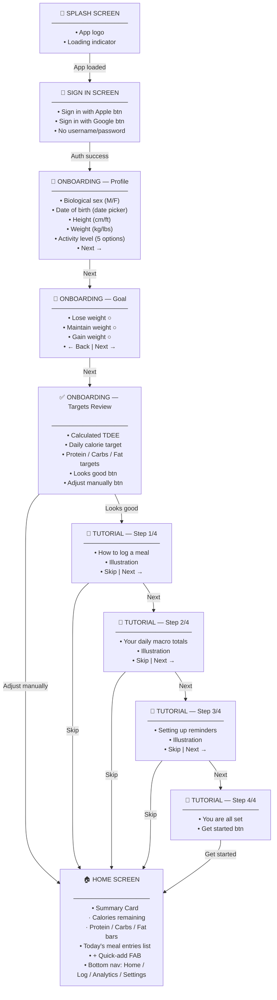

---

### Journey 2: Logging a Meal

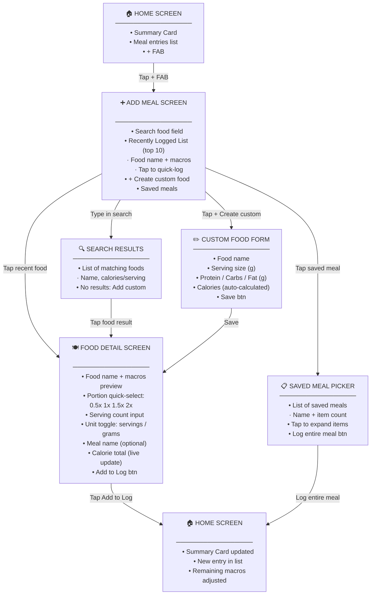

---

### Journey 3: Editing and Deleting an Entry

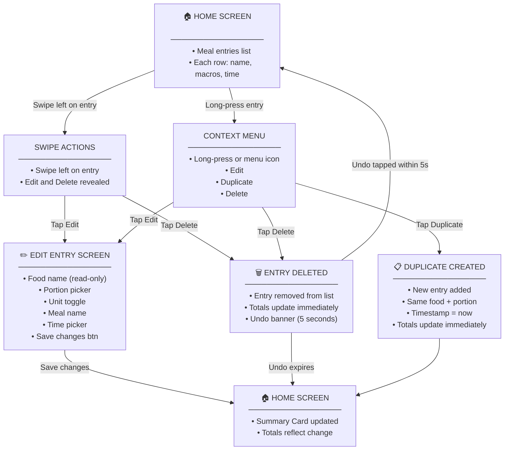

---

### Journey 4: Viewing Analytics

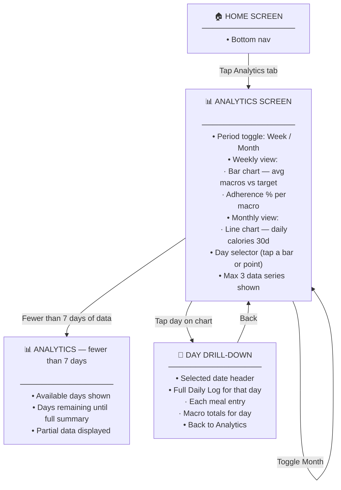

---

### Journey 5: Settings, Profile Edit and Reminders

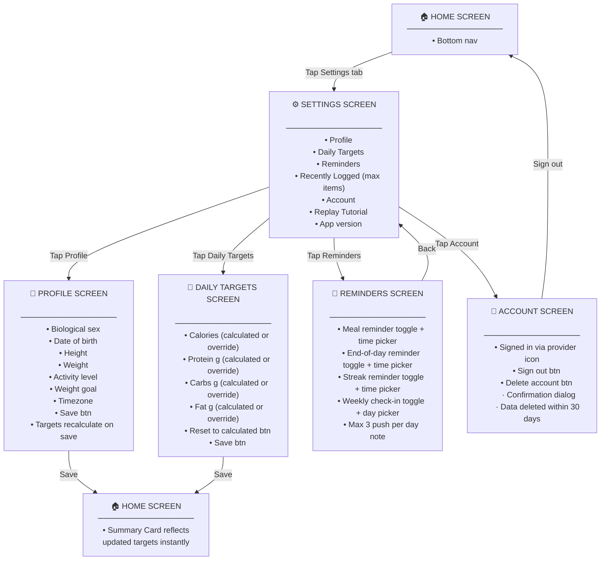

---

### Journey 6: Sharing a Weekly Summary

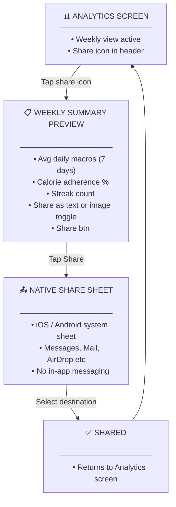


---

## Entity Relationship Diagrams

### PostgreSQL (Backend)

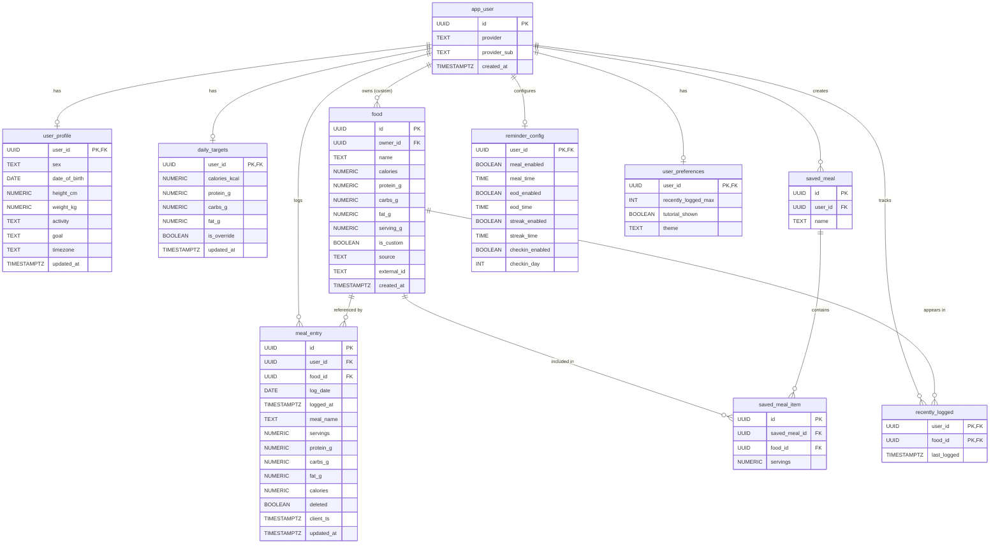

---

### SQLite (Mobile — on-device)

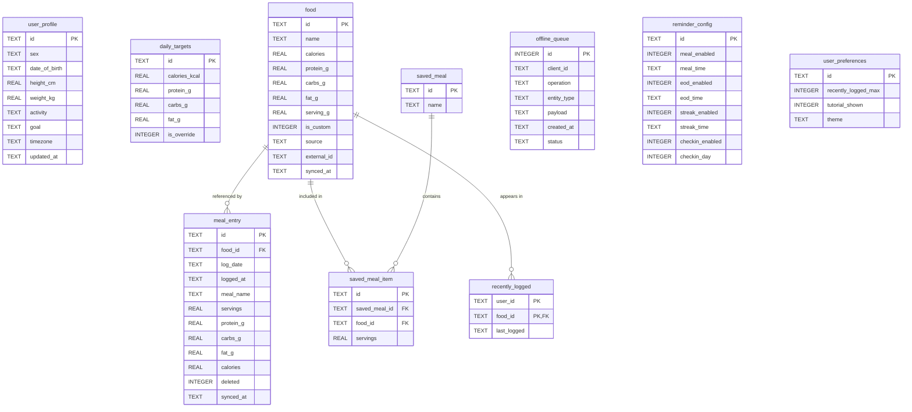
