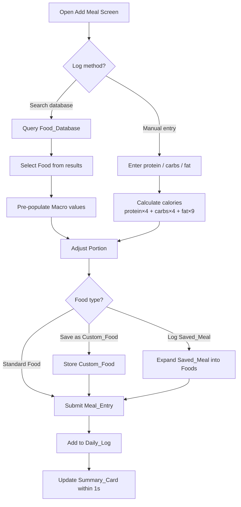
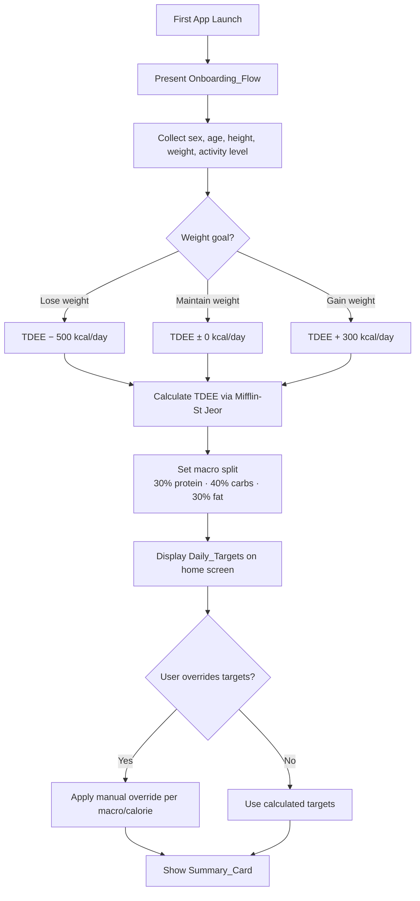
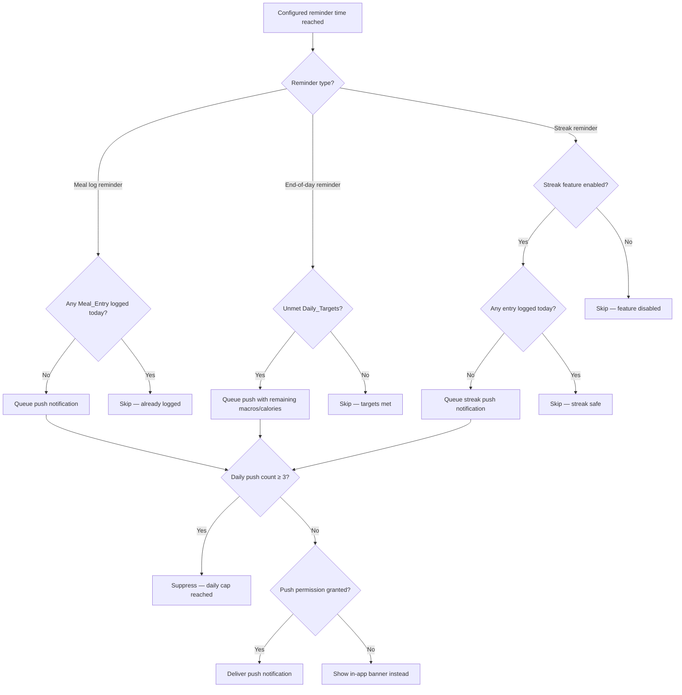
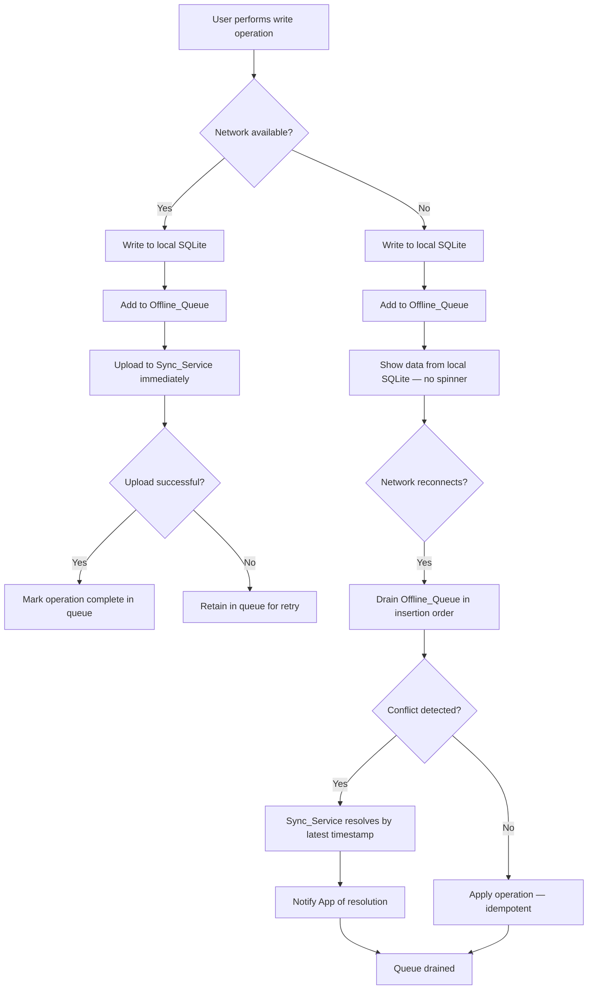
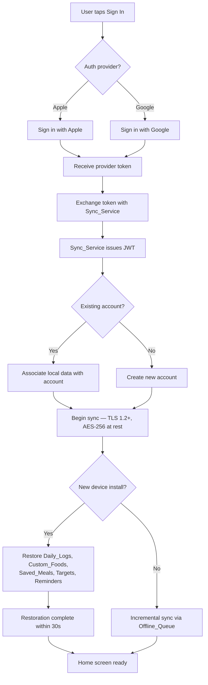

# Requirements Document

## Introduction

MacroFlow is a minimal, clean, and fast mobile application for iOS and Android that tracks a user's daily macronutrient (protein, carbohydrates, fat) and calorie intake. The app prioritizes low friction, speed of use, and an uncluttered interface. Phase 1 covers core tracking, onboarding, reminders, analytics, social sharing, offline support, and account management.

## Glossary

- **App**: The Macro Tracker mobile application running on iOS and Android.
- **User**: A person who has installed and is using the App.
- **Macro**: A macronutrient — protein, carbohydrate, or fat — measured in grams.
- **Calorie**: A unit of energy derived from Macros (4 kcal/g protein, 4 kcal/g carbohydrate, 9 kcal/g fat).
- **Daily_Target**: The User's calculated daily goals for Calories and each Macro.
- **Meal_Entry**: A logged record of one or more Foods consumed at a point in time.
- **Food**: An item with a name and known Macro values per serving.
- **Food_Database**: The aggregated collection of Foods available for search and selection, sourced from Open Food Facts and USDA FoodData Central, supplemented by User-created Custom_Foods.
- **Custom_Food**: A Food created by the User, stored locally and in the cloud.
- **Saved_Meal**: A named collection of Foods saved by the User for reuse.
- **Portion**: A quantity of a Food expressed as a number of servings or grams.
- **Daily_Log**: The complete set of Meal_Entries recorded by the User for a given calendar day.
- **Summary_Card**: The home screen widget displaying remaining Macros and Calories for the current day.
- **Onboarding_Flow**: The sequence of screens shown to a new User to collect profile data and set Daily_Targets.
- **Reminder**: A push notification sent by the App to prompt the User to log meals or review remaining Macros.
- **Streak**: A count of consecutive days on which the User logged at least one Meal_Entry. A Streak is broken if the User does not log any Meal_Entry for an entire calendar day (midnight to midnight in the User's selected timezone). The Streak resets to zero the following day if no entry was logged the previous day.
- **Analytics_View**: The screen displaying weekly and monthly macro adherence and calorie trends.
- **Accountability_Partner**: A person outside the App to whom the User sends weekly summaries.
- **Auth_Provider**: An external authentication service — Sign in with Apple or Sign in with Google.
- **Sync_Service**: The cloud backend responsible for storing and synchronising User data across devices.
- **Offline_Queue**: A local store of Meal_Entries and edits pending upload to the Sync_Service.
- **Recently_Logged_List**: An ordered list of the most recently logged Foods shown on the Add Meal screen.
- **TDEE**: Total Daily Energy Expenditure — the estimated number of Calories a User burns per day.

---

## Requirements

### Requirement 1: Daily Macro Logging

**User Story:** As a User, I want to log my daily food intake by entering macros manually or selecting from a database, so that I can track my protein, carbohydrate, and fat consumption each day.

#### Flow Diagram

#### Acceptance Criteria

1. WHEN the User opens the Add Meal screen, THE App SHALL present manual macro entry (protein, carbohydrate, fat in grams) as the primary logging method, prominently displayed above all other options.
2. THE App SHALL provide food database search as a supplementary option on the Add Meal screen, accessible below the manual entry fields and the Recently_Logged_List.
3. WHEN the device has no network connection and the food has not been previously cached, THE App SHALL disable the Food_Database search field and display a message indicating that database search is unavailable offline; manual entry and Saved_Meals SHALL remain fully functional.
4. WHEN the User selects a Food from search results, THE App SHALL pre-populate the Macro values for the default serving size.
5. WHEN the User submits a Meal_Entry, THE App SHALL add the Meal_Entry to the Daily_Log for the selected date; the User may log entries for any date within the current day and the preceding 6 days (a rolling 7-day window) in the User's configured timezone; logging for dates outside this window or for future dates is not permitted.
6. WHEN the User manually enters protein, carbohydrate, and fat values for a Meal_Entry, THE App SHALL calculate and display the corresponding Calorie total using the formula (protein × 4) + (carbohydrate × 4) + (fat × 9).
7. THE App SHALL allow the User to assign a name and time to each Meal_Entry.
8. WHEN the User saves a Custom_Food, THE App SHALL store the Custom_Food with its name, serving size, and Macro values.
9. WHEN the User edits a Custom_Food, THE App SHALL update all future references to that Custom_Food with the new values without altering previously submitted Meal_Entries.
10. WHEN the User creates a Saved_Meal, THE App SHALL store the collection of Foods and their Portions under a user-defined name; Saved_Meals are private to the User unless they contain Foods sourced from the external Food_Database.
11. WHEN the User edits a Saved_Meal, THE App SHALL update the Saved_Meal's name and food items; existing Meal_Entries previously logged from that Saved_Meal SHALL NOT be altered.
12. WHEN the User deletes a Saved_Meal, THE App SHALL remove it from the Saved_Meal list; existing Meal_Entries previously logged from that Saved_Meal SHALL NOT be affected.
13. WHEN the User logs a Saved_Meal, THE App SHALL add a Meal_Entry for each Food in the Saved_Meal to the Daily_Log.
14. THE Food_Database SHALL be populated by querying two external sources: Open Food Facts (global branded and packaged foods) and USDA FoodData Central (whole and raw ingredient data); results from both sources SHALL be merged and deduplicated before being presented to the User.
15. WHEN the User searches for a Food, THE App SHALL display results from both Open Food Facts and USDA FoodData Central in a single unified list, with each result indicating its source.
16. WHEN a Food is retrieved from an external source and logged or selected by the User, THE App SHALL cache that Food locally in SQLite so it is available offline in future sessions.
17. THE App SHALL attribute Open Food Facts data in accordance with the Open Database License (ODbL) by displaying a visible attribution notice within the App.

---

### Requirement 2: Onboarding and Daily Target Calculation

**User Story:** As a new User, I want to provide my personal stats and weight goal during onboarding, so that the App can automatically set my daily calorie and macro targets.

#### Flow Diagram

#### Acceptance Criteria

1. WHEN the User launches the App for the first time, THE App SHALL present the Onboarding_Flow before showing the home screen.
2. THE Onboarding_Flow SHALL collect the User's biological sex, date of birth, height, weight, activity level, and timezone.
3. THE Onboarding_Flow SHALL ask the User whether the goal is to lose weight, maintain weight, or gain weight.
4. WHEN the User completes the Onboarding_Flow, THE App SHALL calculate TDEE using the Mifflin-St Jeor equation and adjust Calories by −500 kcal/day for weight loss, 0 kcal/day for maintenance, or +300 kcal/day for weight gain.
5. WHEN the App calculates Daily_Targets, THE App SHALL set the default macro split to 30% protein, 40% carbohydrate, and 30% fat of total Calories.
6. THE App SHALL display the Daily_Targets on the home screen in a legible, compact format requiring no scrolling.
7. WHEN the User updates any profile field after onboarding, THE App SHALL recalculate and update the Daily_Targets immediately.
8. THE App SHALL allow the User to manually override the calculated Daily_Targets for Calories and each Macro independently.
9. THE App SHALL provide a Profile screen, accessible from Settings at any time, where the User can edit all fields collected during onboarding: biological sex, date of birth, height, weight, activity level, weight goal, and timezone.
10. ALL date and time calculations (Streak resets, Reminder scheduling, Daily_Log boundaries) SHALL use the User's selected timezone.

---

### Requirement 3: Smart Reminders

**User Story:** As a User, I want to receive timely, non-intrusive reminders to log meals and review my remaining macros, so that I stay consistent without feeling overwhelmed.

#### Flow Diagram

#### Acceptance Criteria

1. WHEN the User has not created any Meal_Entry by a User-configured time, THE App SHALL send a Reminder push notification prompting the User to log a meal.
2. WHEN the end-of-day Reminder time is reached and the User has unmet Daily_Targets, THE App SHALL send a Reminder push notification displaying the remaining Macro and Calorie amounts.
3. WHERE the streak feature is enabled, WHEN the User has not logged any Meal_Entry for the current day by a User-configured time, THE App SHALL send a Streak Reminder push notification.
4. THE App SHALL allow the User to enable or disable each Reminder type independently.
5. THE App SHALL allow the User to configure the time for each Reminder independently.
6. THE App SHALL send no more than three Reminder push notifications per day to the User.
7. IF the operating system denies push notification permission, THEN THE App SHALL display an in-app banner at the configured Reminder time instead.

---

### Requirement 4: Analytics

**User Story:** As a User, I want to see weekly and monthly summaries of my macro and calorie adherence, so that I can understand my progress over time without being overwhelmed by data.

#### Acceptance Criteria

1. THE Analytics_View SHALL display a weekly summary showing the User's average daily intake of each Macro and Calories compared to Daily_Targets for the most recent 7-day period.
2. THE Analytics_View SHALL display a monthly trend showing daily Calorie intake plotted over the most recent 30-day period.
3. THE Analytics_View SHALL display a macro adherence percentage for each Macro calculated as (actual ÷ target) × 100 for the selected period.
4. WHEN the User selects a specific day in the Analytics_View, THE App SHALL display the Daily_Log for that day.
5. THE Analytics_View SHALL present data using minimal chart types — bar or line only — with no more than three data series visible simultaneously.
6. WHEN the User has fewer than 7 days of logged data, THE Analytics_View SHALL display available data and indicate the number of days remaining before a full weekly summary is available.
7. THE App SHALL retain and display Daily_Log history for up to 3 months (92 days) from the current date; data older than 3 months SHALL NOT be displayed in the Analytics_View but SHALL remain stored in the Sync_Service.

---

### Requirement 5: Social and Accountability Sharing

**User Story:** As a User, I want to share my weekly summary with an accountability partner, so that I can stay motivated without needing a social feed or messaging system.

#### Acceptance Criteria

1. THE App SHALL allow the User to generate a weekly summary report containing average daily Macro intake, Calorie adherence percentage, and Streak count for the most recent 7-day period.
2. WHEN the User taps the share action, THE App SHALL invoke the native iOS or Android share sheet to send the weekly summary as text or image.
3. THE App SHALL not include any in-app messaging, social feed, or community features.
4. THE App SHALL allow the User to configure a recurring weekly check-in Reminder that prompts the User to review and share the weekly summary.
5. WHEN the weekly check-in Reminder fires, THE App SHALL include a brief summary in the notification body showing the User's average daily Calories and average intake for each Macro over the most recent 7-day period.

---

### Requirement 6: Recently Logged Foods

**User Story:** As a User, I want to see my recently logged foods on the Add Meal screen, so that I can re-log common items with a single tap.

#### Acceptance Criteria

1. THE App SHALL display the Recently_Logged_List on the Add Meal screen, positioned between the manual entry fields and the food database search field.
2. THE Recently_Logged_List SHALL contain the most recently logged unique Foods ordered by most recent first, up to a User-configurable maximum between 5 and 20 items, defaulting to 10; this setting SHALL be accessible from Settings.
3. WHEN the User taps a Food in the Recently_Logged_List, THE App SHALL open the Food Detail screen for that Food, pre-populated with the default Portion, allowing the User to adjust the Portion and Macro values before confirming the log.
4. WHEN the User logs a Food, THE App SHALL update the Recently_Logged_List immediately to reflect the new order.
5. THE App SHALL deduplicate the Recently_Logged_List so that each Food appears at most once, at the position of its most recent log.

---

### Requirement 7: Portion Scaling

**User Story:** As a User, I want to quickly adjust portion sizes using preset multipliers or gram-based input, so that logging accurate amounts stays fast and simple.

#### Acceptance Criteria

1. THE App SHALL display portion quick-select buttons for 0.5×, 1×, 1.5×, and 2× on the Food detail screen.
2. WHEN the User selects a portion multiplier, THE App SHALL recalculate and display the Macro and Calorie values for the selected Portion immediately.
3. THE App SHALL provide a numeric input field allowing the User to enter an arbitrary serving count or gram weight.
4. WHEN the User switches between serving-based and gram-based input, THE App SHALL convert the current value to the equivalent quantity in the new unit and update the Macro display without requiring the User to re-enter a value.
5. WHEN the User edits the Portion of a previously logged Meal_Entry, THE App SHALL update the Daily_Log totals immediately.

---

### Requirement 8: Daily Summary Card

**User Story:** As a User, I want a minimal home screen dashboard showing my remaining macros and calories at a glance, so that I can assess my day without navigating away from the home screen.

#### Acceptance Criteria

1. THE Summary_Card SHALL display remaining Calories, remaining protein, remaining carbohydrate, and remaining fat for the current day.
2. THE Summary_Card SHALL update within 1 second of any Meal_Entry being added, edited, or deleted.
3. THE Summary_Card SHALL display a quick-add button that navigates the User directly to the Add Meal screen.
4. WHEN remaining Calories reach zero or below, THE Summary_Card SHALL visually indicate that the daily Calorie target has been met or exceeded.
5. WHEN remaining Macros for any individual Macro reach zero or below, THE Summary_Card SHALL visually indicate that the target for that Macro has been met or exceeded.
6. WHEN the User has exceeded their daily Calorie target, THE Summary_Card SHALL display the excess Calorie amount (actual intake minus target) and use a distinct visual treatment — such as a warning colour — to differentiate an over-target state from a within-target state.
7. WHEN the User has exceeded the target for any individual Macro, THE Summary_Card SHALL display the excess amount for that Macro and apply the same distinct visual treatment used for excess Calories.
8. THE Summary_Card SHALL be fully visible on the home screen without scrolling on any supported device screen size.

---

### Requirement 9: Offline Functionality

**User Story:** As a User, I want to log meals and view my data without an internet connection, so that the App works reliably regardless of network availability.

#### Flow Diagram

#### Acceptance Criteria

1. THE App SHALL allow the User to create, edit, and delete Meal_Entries while the device has no network connection.
2. WHEN the User performs a write operation while offline, THE App SHALL store the operation in the Offline_Queue.
3. WHEN the device regains network connectivity, THE App SHALL automatically upload all pending operations from the Offline_Queue to the Sync_Service without requiring User action.
4. WHILE the device has no network connection, THE App SHALL display all previously synced data without degradation of the core logging experience.
5. IF a conflict is detected between an Offline_Queue operation and a server-side record during sync, THEN THE Sync_Service SHALL resolve the conflict by applying the most recent timestamp and notify the App of the resolution.
6. THE App SHALL not display any loading spinners or error states attributable to network unavailability during normal offline use.

---

### Requirement 10: Error Tolerance and Editing

**User Story:** As a User, I want to edit, delete, and duplicate logged entries after the fact, so that I can correct mistakes without re-logging everything from scratch.

#### Acceptance Criteria

1. THE App SHALL allow the User to edit the Food, Portion, and time of any Meal_Entry logged within the current day and the preceding 6 days (a rolling 7-day window) in the User's configured timezone; entries older than 7 days are read-only.
2. THE App SHALL allow the User to delete any Meal_Entry logged within the rolling 7-day window; entries older than 7 days are read-only and cannot be deleted.
3. THE App SHALL allow the User to duplicate any Meal_Entry within the 7-day window, creating a new Meal_Entry with the same Food and Portion timestamped at the current time on the current day.
4. WHEN the User edits or deletes a Meal_Entry, THE App SHALL update the Daily_Log totals and the Summary_Card within 1 second.
5. THE App SHALL provide edit and delete actions discoverable via swipe gesture and via a contextual menu on each Meal_Entry.
6. WHEN the User deletes a Meal_Entry, THE App SHALL display an undo option for a minimum of 5 seconds before permanently removing the record.

---

### Requirement 11: Account System and Cloud Sync

**User Story:** As a User, I want to sign in with Apple or Google and have my data securely synced across devices, so that I never lose my logs and can switch devices without friction.

#### Flow Diagram

#### Acceptance Criteria

1. THE App SHALL support Sign in with Apple and Sign in with Google as the only authentication methods.
2. WHEN the User signs in, THE Sync_Service SHALL associate all local data with the User's account and begin syncing.
3. WHEN the User installs the App on a new device and signs in, THE App SHALL restore the User's Daily_Logs, Custom_Foods, Saved_Meals, Daily_Targets, and Reminder settings from the Sync_Service within 30 seconds on a standard broadband connection.
4. THE Sync_Service SHALL encrypt all User data in transit using TLS 1.2 or higher and at rest using AES-256.
5. THE App SHALL not require the User to create a username, password, or profile beyond what is provided by the Auth_Provider.
6. THE App SHALL allow the User to delete their account and all associated data from within the App, completing the deletion within 30 days.
7. WHEN the User signs out, THE App SHALL retain all local SQLite data on the device in an unauthenticated state; upon next sign-in with the same account, THE App SHALL re-associate the local data with the User's account and resume syncing.
8. WHEN the User signs in on a device that has local unauthenticated data, THE Sync_Service SHALL merge that data with the User's existing cloud data, applying conflict resolution by latest timestamp.

---

### Requirement 12: Dark and Light Mode

**User Story:** As a User, I want to control the App's display theme — either by following my device setting or by choosing manually — so that the interface is comfortable to use in any lighting condition.

#### Acceptance Criteria

1. THE App SHALL detect the device system theme (light or dark) at launch and apply the corresponding App color scheme by default.
2. WHEN the device system theme changes while the App is running and the User has not set a manual override, THE App SHALL switch to the new color scheme within 1 second without requiring a restart.
3. THE App SHALL maintain a consistent visual style and legibility in both light and dark color schemes.
4. THE App SHALL provide a theme selector in Settings with three options: Light, Dark, and System (default). WHEN the User selects Light or Dark, THE App SHALL apply that theme immediately and persist the preference; WHEN the User selects System, THE App SHALL revert to following the device system setting.
5. THE User's theme preference SHALL be persisted locally and synced to the User's account so it is restored on new device installs.

---

### Requirement 13: Onboarding Tutorial

**User Story:** As a new User, I want a brief, skippable walkthrough on first launch, so that I understand how to log food and find my daily macros without reading a manual.

#### Acceptance Criteria

1. WHEN the User completes the Onboarding_Flow for the first time, THE App SHALL present a tutorial walkthrough of no more than 4 screens.
2. THE tutorial SHALL cover: how to log a Food, where to view daily Macro totals, and how to configure Reminders.
3. THE App SHALL display a clearly labelled skip button on every tutorial screen.
4. WHEN the User taps the skip button, THE App SHALL immediately dismiss the tutorial and navigate to the home screen.
5. THE App SHALL not show the tutorial again after the User has completed or skipped it; a `tutorial_shown` flag SHALL be persisted to the User's account in the remote database so the tutorial is suppressed across all devices.
6. THE tutorial SHALL complete in 30 seconds or fewer when the User advances through all screens without pausing.
7. THE App SHALL allow the User to replay the tutorial at any time from the Settings screen.
